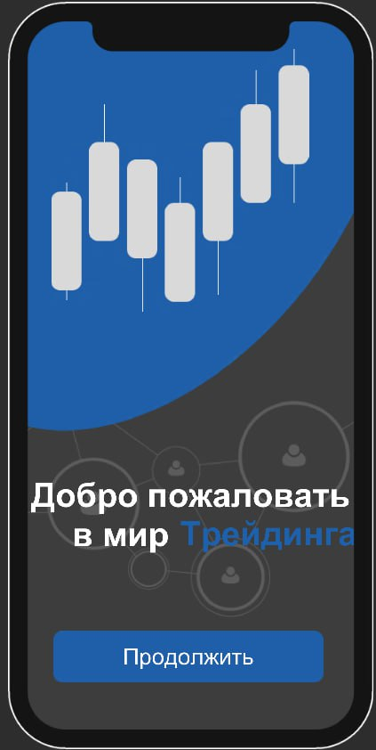

# Trading and Education App

This app provides a dual experience with two primary modes: **"Predict the Chart"** and **"Education Mode"**. Users can engage in a simulated trading experience or learn about trading concepts through articles, videos, and quizzes. The app is designed to be both informative and interactive, making it ideal for users looking to improve their trading knowledge and skills.

##

## Features

- **Predict the Chart Mode**: In this mode, users are presented with a standard trading chart that simulates the rise and fall of an asset’s value. The goal is simple – predict whether the value will go up or down. Each correct or incorrect answer is tracked, providing users with a running tally of their performance. This mode offers a fun, risk-free way to practice predicting market trends.

  

- **Education Mode**: This mode is designed to help users learn trading concepts through a variety of content types. Users can choose from three categories:
  - **Videos**: Watch educational videos on trading topics.
  - **Articles**: Read in-depth articles to deepen trading knowledge.
  - **Quizzes**: Test knowledge with quizzes after learning. This interactive approach reinforces learning and keeps users engaged.

  

- **Language Settings**: The app includes a settings menu where users can change the language, making it accessible to a global audience.

- **Footer with Mode Selection**: A footer menu allows users to quickly switch between "Predict the Chart" and "Education Mode," ensuring easy navigation and a smooth user experience.

## How It Works

1. **Start Menu**: From the main menu, users can select between "Predict the Chart" and "Education Mode." The settings menu is also accessible from here, allowing users to adjust language preferences.

2. **Predict the Chart Mode**: Users interact with a live chart and make predictions on whether the value will go up or down. The app keeps track of correct and incorrect answers, offering a simple way to test intuition and improve predictive skills.

3. **Education Mode**: Users can choose between videos, articles, and quizzes to learn more about trading. This mode allows users to switch seamlessly between different types of content, catering to different learning styles.

4. **Footer Navigation**: The footer includes toggles for easy switching between "Predict the Chart" and "Education Mode," providing a seamless experience for users as they navigate the app.

### Example Quiz Data Structure

The app uses a structured format for storing quiz questions, answers, and other educational content:

- **Questions**: Multiple-choice questions to test trading knowledge.
- **Options**: A list of possible answers for each question.
- **Correct Answer**: The correct option for each question, used for scoring.

## Getting Started

1. Clone the repository and open the project in Unity.
2. Customize the educational content by adding videos, articles, and quizzes as needed.
3. Build and deploy the app for iOS and Android.

## Usage

In the app, users can:

- Predict market trends in "Predict the Chart" mode.
- Learn through videos, articles, and quizzes in "Education Mode."
- Switch between modes easily using the footer navigation.
- Change the app's language in the settings menu.

---

# Приложение для Торговли и Обучения

Это приложение предоставляет два основных режима: **"Угадать куда пойдет график"** и **"Режим образования"**. Пользователи могут либо практиковаться в торговле на виртуальной платформе, либо обучаться торговым концепциям через статьи, видео и викторины. Приложение разработано как для обучения, так и для развлечения, что делает его идеальным инструментом для пользователей, желающих улучшить свои знания и навыки в торговле.

##

## Особенности

- **Режим Угадать куда пойдет график**: В этом режиме пользователи видят стандартный график, который имитирует рост и падение стоимости актива. Цель проста – угадать, пойдет стоимость вверх или вниз. Каждое правильное или неправильное предсказание фиксируется, давая пользователям возможность отслеживать свои успехи. Этот режим предлагает интересный и безопасный способ практиковаться в предсказании рыночных тенденций.

  

- **Режим Образования**: Этот режим предназначен для обучения пользователей торговым концепциям с помощью разнообразного контента. Пользователи могут выбирать из трёх категорий:
  - **Видео**: Просмотр образовательных видеороликов на темы, связанные с торговлей.
  - **Статьи**: Чтение углублённых статей для расширения знаний.
  - **Викторины**: Тестирование знаний с помощью викторин после обучения. Такой интерактивный подход помогает закрепить знания и поддерживает интерес пользователей.

  

- **Настройки Языка**: Приложение включает меню настроек, где пользователи могут изменять язык, что делает его доступным для глобальной аудитории.

- **Футер с Переключателями Режимов**: Футер позволяет быстро переключаться между режимами "Угадать куда пойдет график" и "Режим образования", обеспечивая лёгкую навигацию и удобство использования.

## Как Это Работает

1. **Стартовое Меню**: В главном меню пользователи могут выбрать между режимами "Угадать куда пойдет график" и "Режим образования". Также здесь доступно меню настроек, позволяющее изменять предпочтения языка.

2. **Режим Угадать куда пойдет график**: Пользователи взаимодействуют с графиком и делают предположения о том, пойдёт ли стоимость вверх или вниз. Приложение ведёт учёт правильных и неправильных ответов, что позволяет улучшить интуицию и навыки предсказания.

3. **Режим Образования**: Пользователи могут выбирать между видео, статьями и викторинами для изучения торговых концепций. Этот режим позволяет переключаться между различными видами контента, подходящими для разных стилей обучения.

4. **Навигация через Футер**: В футере расположены переключатели для лёгкого перехода между режимами "Угадать куда пойдет график" и "Режим образования", обеспечивая пользователю удобство при работе с приложением.

### Пример Структуры Викторины

Приложение использует структурированный формат для хранения вопросов викторины, ответов и другого образовательного контента:

- **Вопросы**: Вопросы с несколькими вариантами ответов для проверки знаний в торговле.
- **Варианты**: Список возможных ответов на каждый вопрос.
- **Правильный Ответ**: Правильный вариант для каждого вопроса, используется для подсчёта очков.

## Начало Работы

1. Склонируйте репозиторий и откройте проект в Unity.
2. Настройте образовательный контент, добавив видео, статьи и викторины по мере необходимости.
3. Соберите и разверните приложение для iOS и Android.

## Использование

В приложении пользователи могут:

- Предсказывать рыночные тренды в режиме "Угадать куда пойдет график".
- Обучаться через видео, статьи и викторины в "Режиме образования".
- Легко переключаться между режимами с помощью навигации через футер.
- Изменять язык приложения в меню настроек.
